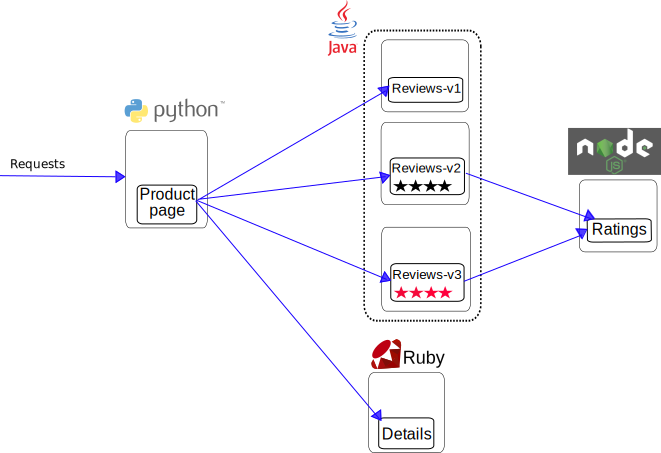

# kind-istio
Deploy Istio on [Kind](https://github.com/kubernetes-sigs/kind)

## Prerequisites
* Get [ASDF](https://github.com/asdf-vm/asdf)
```bash
git clone https://github.com/asdf-vm/asdf.git ~/.asdf
printf 'source $HOME/.asdf/asdf.sh
source $HOME/.asdf/completions/asdf.bash
' >> $HOME/.bashrc
source $HOME/.bashrc
```

* Add and install ASDF plugins
```bash
for PLUGIN in $(cut -d ' ' -f1 << .tool-versions); do
  echo "Adding $PLUGIN"
  asdf plugin-add $PLUGIN;
done

# now install the exact plugin versions
asdf install
```

## Setup a new `kind` cluster
```bash
kind create cluster --name istio-testing`
kubectl apply -f https://raw.githubusercontent.com/kubernetes/dashboard/v2.0.0/aio/deploy/recommended.yaml
kubectl create clusterrolebinding default-admin --clusterrole cluster-admin --serviceaccount=default:default

# get a bearer token
token=$(kubectl get secrets -o jsonpath="{.items[?(@.metadata.annotations['kubernetes\.io/service-account\.name']=='default')].data.token}" | base64 --decode)

echo "Bearer token for the dashboard"
echo $token

kubectl proxy
```
* Go to [Dashboard](http://localhost:8001/api/v1/namespaces/kubernetes-dashboard/services/https:kubernetes-dashboard:/proxy/)

## Install Istio
* Install Istio
```bash
istioctl install
```
* Check the deployment is running
```bash
kubectl -n istio-system get deploy
```
* Enable automatic injection of Istio sidecar container (envoy)
```bash
kubectl label namespace default istio-injection=enabled
```

## Deploy sample Bookinfo app
Official page: https://istio.io/latest/docs/examples/bookinfo/

## Routing map


### Deploy all micro-services
```bash
cd istio # git submodule
git pull

kubectl apply -f samples/bookinfo/platform/kube/bookinfo.yaml

# check k8s pods and services
watch 'kubectl get pods'
kubectl get svc

# confirm the stack is operational
kubectl exec \
    "$(kubectl get pod -l app=ratings -o jsonpath='{.items[0].metadata.name}')" \
    -c ratings -- curl productpage:9080/productpage | grep -o "<title>.*</title>"
```

## Setup Istio Gateway
* Check official [docs](https://istio.io/latest/docs/concepts/traffic-management/#gateways)

```bash
kubectl apply -f samples/bookinfo/networking/bookinfo-gateway.yaml
kubectl get gateway

# Execute the following command to determine if your Kubernetes cluster is running in an environment that supports external load balancers
#   - Kind doesn't support load balancers, only NodePort
#   - if the "EXTERNAL-IP" is set, your environment supports external load balancers. Note: Kind doesn't support load balancers, only NodePort
configuration

kubectl get svc istio-ingressgateway -n istio-system

# export host IP and node ports
export INGRESS_PORT=$(kubectl -n istio-system get service istio-ingressgateway \
    -o jsonpath='{.spec.ports[?(@.name=="http2")].nodePort}')
export SECURE_INGRESS_PORT=$(kubectl -n istio-system get service istio-ingressgateway \
    -o jsonpath='{.spec.ports[?(@.name=="https")].nodePort}')
export TCP_INGRESS_PORT=$(kubectl -n istio-system get service istio-ingressgateway \
    -o jsonpath='{.spec.ports[?(@.name=="tcp")].nodePort}')
# if your running on kind
export INGRESS_HOST=$(kubectl get pod -l istio=ingressgateway \
    -n istio-system -o jsonpath='{.items[0].status.hostIP}')

# if you are on minikube
# export INGRESS_HOST=$(minikube ip)

export GATEWAY_URL=$INGRESS_HOST:$INGRESS_PORT
```

* Check the content
```bash
curl -s "http://${GATEWAY_URL}/productpage" | grep -o "<title>.*</title>"

# if you have lynx installed, you can check the whole page
# curl -s "http://${GATEWAY_URL}/productpage" | lynx -stdin
```

## Kiali

## SSL management

## Canary routing

## Routing policies

## Circuit breakers

## Fault injection

## Istio upgrades

## Performance

## References
* https://istio.io/latest/docs/setup/install/istioctl/
